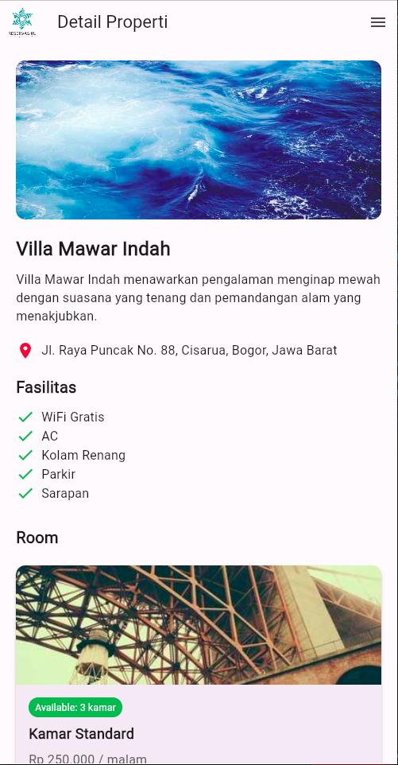

    <a href="https://github.com/ajiistwn/reservasiku-laravel" target="_blank">    
        <picture>
            <source srcset="./images/logo-vertikal-white.png" media="(prefers-color-scheme: dark)">
            
        </picture>
   </a>     
    

# About Reservasiku

Reservasiku application is an online reservation application. This application is made using flutter technology that can make one application run on various devices or cross-platform, this application is a representation of a mobile application that is a continuation of the Reservasiku web app which was previously made with laravel.

# Contributor

- **[Afdan Rivaldi](https://github.com/Afdan678)** : Tech Researcher & Lead Academic Writer
- **[Alvin Nugraha Saputra](mailto:alvinoegraha@gmail.com)** : UI/UX Design & Researcher
- **[Aji Setiawan](https://github.com/ajiistwn)** : Tech Lead & Fullstack Developer
- **[Akbar Fazar Fadililah](https://github.com/fazar212)** : Web Developer
  Developer
- **[Sauqi Zamani](https://)** : Academic Writer
- **[Axel Elyas Ginting](https://)** : Academic Writer

We greatly appreciate and respect anyone who contributes to this project. Both for written and unwritten names.

# Technology

- **[Flutter](https://lhttps://flutter.dev/).**

The technology we use is technology that is requested by many users and stakeholders in developing this project

# Feature

This application is here to make it easier for users to connect with Reservasiku platform, to be closer and easier, making users comfortable.

## Landing Page

This is the main page of my Mobile reservation application. Here, a form is presented directly to search for the desired accommodation for the user.

## Explore Page

If the search form on the landing page is submitted, the user will be directed to the explore page and display a list of properties that match the user's wishes.

## Detail Property Page

When a user selects a property, this page will appear and display the property details along with a list of available rooms. then you can make a reservation.

## About Page

This is a page about my reservation company. It contains the background of the birth of this application.

## Drawer Navigasi

This is the navigation to reach all existing pages.

# License

Reservasiku repository licensed under the [Creative Commons Attribution-NonCommercial 4.0 International (CC BY-NC 4.0)](https://creativecommons.org/licenses/by-nc/4.0/).
